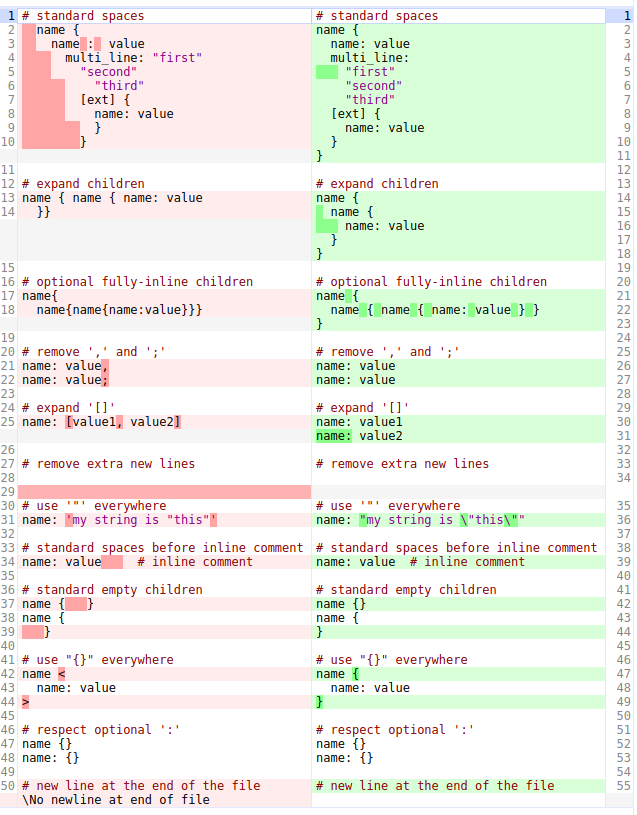

# Text Proto Formatter

`txtpbfmt` parses, edits and formats text proto files in a way that preserves comments.

This saves development (read/edit/review) time and enables automated edits.

## How to format existing text proto files?

Install:

```shell
$ go install github.com/protocolbuffers/txtpbfmt/cmd/txtpbfmt@latest
```

Format files in-place:

```shell
$ ${GOPATH}/bin/txtpbfmt [FILES]
```

Write formatted input to stdout:

```shell
$ ${GOPATH}/bin/txtpbfmt < [FILE]
```

## What does it do?

Main features:



Configurable features:

-   Fields on
    [`parser.Config`](https://github.com/search?q=repo%3Aprotocolbuffers%2Ftxtpbfmt+%22type+Config+struct%22&type=code)
-   Corresponding `# txtpbfmt: feature` names on
    [`parser.addToConfig`](https://github.com/search?q=repo%3Aprotocolbuffers%2Ftxtpbfmt+%22func+addToConfig%28%22&type=code)
-   Examples on [config.md](docs/config.md)

## Is there an API to edit text proto files while preserving comments?

Yes, see [ast.go](ast/ast.go).

## How to disable it?

You can disable formatting for a whole file by adding a comment with "#
txtpbfmt: disable" to the top of the file (before the first non-empty
non-comment line), eg:

```textproto
# File overview ...

# txtpbfmt: disable

content: { ... }
```

## Which file extension should I use for my text proto files?

The `.textproto` extension is the most used extension inside Google (the second
most popular choice is `.textpb`).

## Which tools support it? How to format on save?

Currently there is no open source integration with any editor.

## See also

* [Text Format Language Specification](https://developers.google.com/protocol-buffers/docs/text-format-spec)
